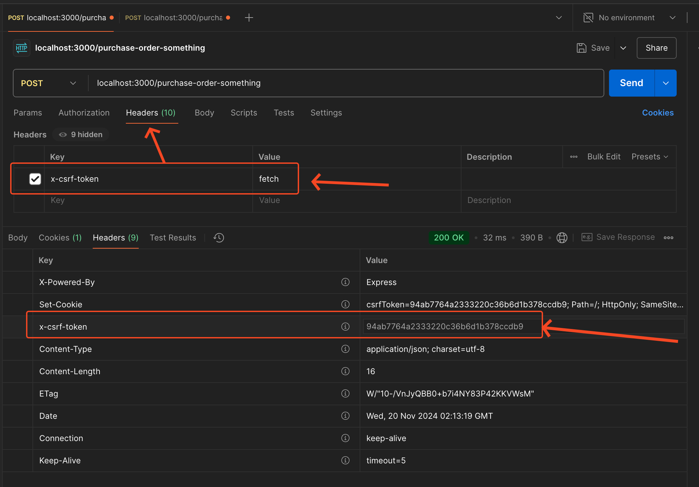
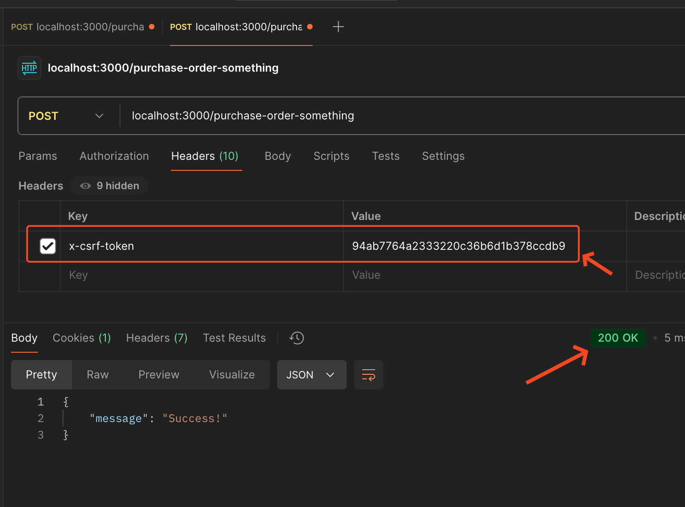

### get csrf token



```bash
$ curl -i -X POST 'localhost:3000/purchase-order-something' -H 'x-csrf-token: fetch'
```

### use csrf token

most of the time, the server will read the csrf token from the `Cookie`, but in some cases require to use the csrf token in the header, for example, when the server is not able to read the cookie.



```bash
# where token is 309a4ebbda71e7d98b6cfd93a7490c50
$ curl -i -X POST 'localhost:3000/purchase-order-something' -H 'x-csrf-token: 309a4ebbda71e7d98b6cfd93a7490c50' -H 'Cookie: csrfToken=309a4ebbda71e7d98b6cfd93a7490c50'
```
